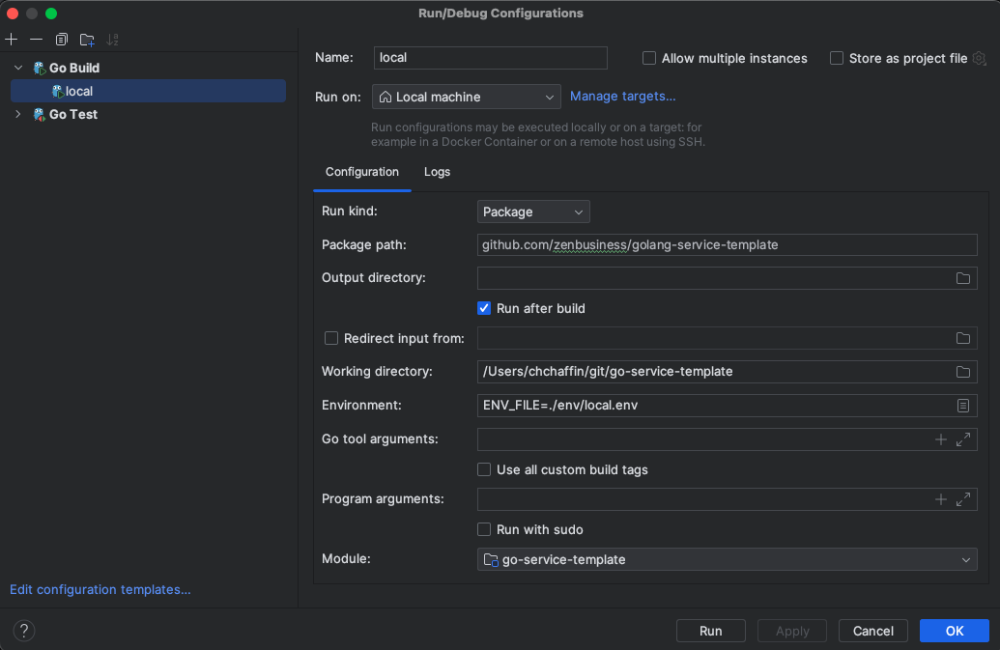

# golang-application-template

# New Service Checklist
1. Clone template to your new service
2. Configure project to match your service name
3. Set local env vars in env/local.env
4. Configure [Snyk Project](https://counsl.atlassian.net/wiki/spaces/ENG/pages/3813867616/Configuring+Synk+for+a+Github+Project)
5. Configure repos CloudBuild files
6. Deploy

# Local Development
First, let's clone this template:

```bash
git clone git@github.com:zenbusiness/golang-service-template.git
```

## Setting up your environment
Before you can start up the server and download packages, you'll need to configure your local environment
for Go development. The first thing any new developer should do with this template is read through:
- [Local Go Development](LocalGoDevelopment.md)
- [Set your .netrc](netrc.md)
- [Setting Environment Variables](SettingEnvVars.md)
- [Deploying locally with Docker](LocalBuild.md)

#### When ready to ship to dev, there is a playbook
- [Deploying your application to Dev](DeploymentManifest.md)


### Starting up the server
Download our necessary modules for local development:
```bash
go mod vendor
```

Set the following environment variable
`ENV_FILE=./env/local.env`

From your IDE you should now be able to simply click "run" on main in main.go and be good to go.

Your build configurations should look like this


For any errors, please see the [Local Go Development](LocalGoDevelopment.md) and [Set your .netrc](netrc.md) documents to make sure your environment
is configured correctly. For any other issues please reach out to the Slack Channel: `div-core-services-public`

### Testing locally
You can send a request to the local server using grpcurl. If you don't have that installed please see the [Local Go Development](LocalGoDevelopment.md)
```shell
grpcurl -plaintext -H "X-LaunchDarkly-Context: base64encodedJsonHere" -d "`cat examples/helloworld.json`" localhost:8080 zenbusiness.misc.v1alpha1.HelloWorldService/SayHello
```

You should see a json response in your terminal. Place breakpoints to start inspecting parts of your code.

# Starting a new Golang project

Please follow the steps outlined in Confluence: [Building a new service or application](https://counsl.atlassian.net/l/cp/urQAsYdj). Return here to finish setting up your local environment.
